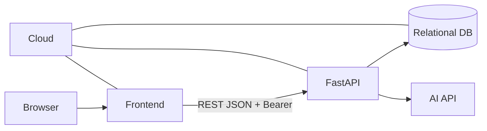
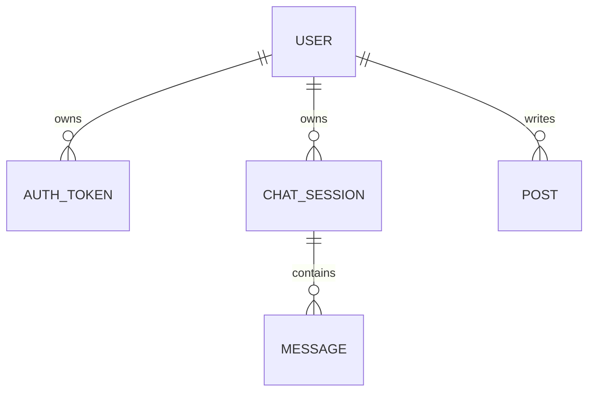

# B7-2 Round 01 — Beginner Guide

구분: **선택 Term Project / 고도화 (OPTIONAL / ADVANCED)**  
현재 모드: **Phase A — REFERENCE BUILD**

> 지금은 Project B 기준 구현·학습자료·검증계획을 먼저 준비합니다. 실제 AI API, 팀 PR/commit, cloud URL과 Evidence는 Phase C에서 검증합니다.

## 00. 프로젝트 한눈에 보기

B7-2는 Project A AI Chat MVP를 **사용자 인증·데이터 소유권·게시판·REST API·클라우드·기술 문서**까지 갖춘 서비스로 확장하는 프로젝트입니다.

```text
회원가입/로그인
→ 내 ChatSession
→ AI 대화 저장
→ 게시판 공유
→ 작성자 권한
→ Cloud 배포
→ ERD/API/Architecture 문서
```

## 01. Reference Architecture



Frontend는 REST API만 사용하고, Backend는 인증·소유권·DB·AI API를 담당합니다.

## 02. Reference 기술 선택

- Frontend: HTML/CSS/Vanilla JavaScript
- Backend: FastAPI
- ORM: SQLAlchemy
- Local DB: SQLite
- Password: PBKDF2 hash
- Auth: opaque Bearer access token
- AI: `.env`의 URL/Key/Model을 사용하는 HTTP client

공식 Mission은 React를 필수로 지정하지 않으므로 Reference는 REST 구조를 가장 단순하게 이해할 수 있는 frontend를 선택했습니다.

## 03. 핵심 용어

### 인증 (Authentication)
사용자가 누구인지 확인합니다. 회원가입/로그인/token이 해당합니다.

### 데이터 소유권 (Ownership)
데이터가 어느 사용자에게 속하는지 DB FK와 서버 검증으로 제한합니다.

### Bearer Token
로그인 후 API 요청의 `Authorization` 헤더에 실어 보내는 인증 토큰입니다.

### RESTful API
URL을 자원 중심으로 구성하고 GET/POST/PUT/DELETE와 HTTP status를 의미에 맞게 사용하는 방식입니다.

### ERD
DB 엔티티, PK/FK, 관계를 표현한 다이어그램입니다.

### API 명세
Frontend와 Backend가 어떤 URL/method/request/response/status로 통신하는지 합의하는 문서입니다.

## 04. 데이터 구조



User가 ChatSession과 Post를 소유하므로 서버는 current user의 ID를 기준으로 접근을 제한합니다.

## 05. 인증 흐름

```text
회원가입
→ password hash 저장
→ 로그인
→ access token 발급
→ Frontend가 Bearer token 전송
→ Backend가 token hash로 사용자 확인
→ 보호 API 실행
→ 로그아웃 시 token 폐기
```

DB에는 raw access token 대신 SHA-256 hash를 저장합니다.

## 06. Chat 소유권

ChatSession 조회는 `session.id`만 보지 않고 반드시 `session.user_id == current_user.id` 조건과 함께 확인합니다.

다른 사용자의 세션에는 404를 반환하도록 Reference를 설계했습니다. 이는 해당 세션의 존재 여부도 불필요하게 노출하지 않기 위한 선택입니다.

## 07. 게시판 권한

- 목록: 공개
- 상세: 공개
- 작성: 로그인 필요
- 수정: 작성자 본인
- 삭제: 작성자 본인
- 다른 로그인 사용자의 수정/삭제: 403

## 08. AI 흐름

```text
사용자 메시지
→ DB 저장
→ 같은 ChatSession 최근 context 조회
→ AI API 호출
→ AI 답변 수신
→ assistant Message DB 저장
→ Frontend 출력
```

실제 `AI_API_URL`, `AI_API_KEY`, `AI_MODEL`은 Phase C에서 사용자 Provider에 맞춰 로컬 `.env`에만 입력합니다.

## 09. 기술 문서

Reference에 다음 문서를 준비했습니다.

- `docs/erd.md`
- `docs/api-spec.md`
- `docs/architecture.md`
- `docs/requirements-mapping.md`
- `docs/collaboration.md`
- `docs/deployment-checklist.md`

## 10. Phase C 로컬 환경

```bash
cd training/round-01-clear/reference
python3 --version
python3 -m venv .venv
source .venv/bin/activate
python -m pip install -r requirements.txt
cp .env.example .env
# 실제 AI 값은 로컬 .env에서만 편집
uvicorn backend.main:app --reload
```

정상 확인 위치:

- `http://localhost:8000`
- `http://localhost:8000/docs`
- `http://localhost:8000/health`

## 11. Phase C 실제 따라가기 순서

1. 환경/Secret 확인
2. 서버 기동
3. User A 회원가입
4. User A 로그인
5. 로그인 UI 확인
6. ChatSession 생성
7. 실제 AI 메시지 전송/응답
8. 대화 재조회
9. 게시글 작성/수정/삭제
10. User B 회원가입/로그인
11. User B가 User A ChatSession 접근 → 403/404
12. User B가 User A Post 수정/삭제 → 403
13. 로그아웃 후 보호 API → 401
14. DB ownership 직접 확인
15. Cloud 배포
16. 외부 전체 flow
17. Git PR/commit/팀 역할 검증
18. Cloud cleanup
19. Evidence
20. Project CLEAR Gate

각 실제 Step은 Phase C에서 ① 왜 하는가 → ⑩ 완료 확인 형식으로 한 단계씩 수행합니다.

## 12. Reference 검증

```bash
bash environment/verify.sh
```

이 스크립트는 파일/문법/모델/ownership/secret 패턴을 검사하도록 설계했습니다.

**아직 실제 실행한 것이 아니므로 PASS로 간주하지 않습니다.**

## 13. DB 직접 확인

Phase C에서 실제 데이터가 생성된 뒤:

```bash
python environment/inspect_db.py
```

password/token은 전체 값을 출력하지 않고 hash 앞부분만 표시하도록 했습니다.

## 14. Cloud / Collaboration

공식 요구에는 실제 외부 URL과 실제 Git 이력이 필요합니다.

### Cloud

- 실제 provider 선택
- 환경 변수/Secret 설정
- 외부 `/health` 200
- 외부 회원가입→로그인→AI→게시판 전체 flow
- 실습 종료 후 불필요 리소스 cleanup

### Git

```text
feature/* → develop → main
```

- main 직접 push 금지
- 기능 단위 PR
- 팀원별 유의미 커밋 10회 이상
- 팀 역할/개인별 작업 요약

Reference가 이 이력을 대신 만들지 않습니다.

## 15. 자주 발생하는 오류

### AI API가 502
`.env`의 URL/Key/Model, 네트워크, Provider 응답 형식을 확인합니다. Key 값을 채팅에 보내지 않습니다.

### 다른 사용자 데이터가 보임
ChatSession/Post 조회 조건에 current user ID가 포함되는지 확인합니다.

### 401
로그인 token이 없거나 logout으로 폐기되었는지 확인합니다.

### 403
로그인은 되었지만 해당 Post의 작성자가 아닌 경우 의도된 결과일 수 있습니다.

### 404 ChatSession
없는 session이거나 다른 사용자의 session이면 Reference 정책상 404입니다.

### DB가 다른 위치에 생성됨
Reference 디렉터리에서 Uvicorn을 실행했는지 확인합니다.

## 16. Evidence

`evidence/README.md`에 인증, 2-user ownership, AI, 게시판, REST, cloud, Git 협업, cleanup까지 실제 Evidence 목록을 정의했습니다.

핵심 원칙:

```text
Requirement → Implementation → Verification → Evidence
```

## 17. Project CLEAR

현재는 Reference Build입니다.

```text
Reference implementation/docs
+ 실제 AI Runtime
+ 실제 2-user ownership
+ 실제 cloud URL/full flow
+ 실제 feature→develop→main PR
+ 팀원별 10+ meaningful commits
+ 실제 Evidence
+ Secret 안전성
= ✅ B7-2 CLEAR
```

이 조건 전에는 CLEAR로 표시하지 않습니다.
