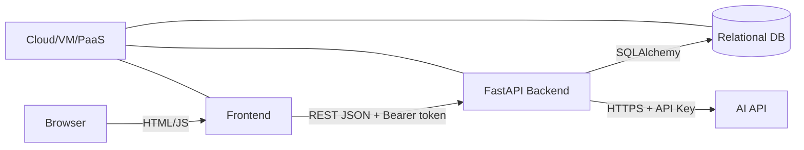

# B7-2 System Architecture



## 컴포넌트 역할

- **Frontend**: 회원가입/로그인 UI, 대화/게시판 UI, REST API 호출. 토큰은 Reference에서 `sessionStorage`에 보관합니다.
- **Backend**: 인증, 데이터 소유권 검증, Chat/Post REST API, AI API 호출.
- **Database**: User/AuthToken/ChatSession/Message/Post 관계와 소유권 저장.
- **AI API**: 모델 응답 생성. URL/Key/Model은 `.env`로 주입합니다.
- **Cloud**: 외부 URL과 런타임 인프라. 실제 Provider/URL은 Phase C에서 결정합니다.

## 요청 흐름

```text
Browser
→ REST API
→ Bearer token 검증
→ current user
→ ownership check
→ DB read/write
→ (chat only) AI API
→ JSON response
→ Frontend render
```

## 배포 전용 NEEDS-RUNTIME

Reference는 cloud-independent하게 작성합니다. 실제 AWS/GCP/Azure/PaaS 선택, 퍼블릭 URL, HTTPS, 리소스 삭제/비용 확인은 Phase C Evidence로만 확정합니다.
