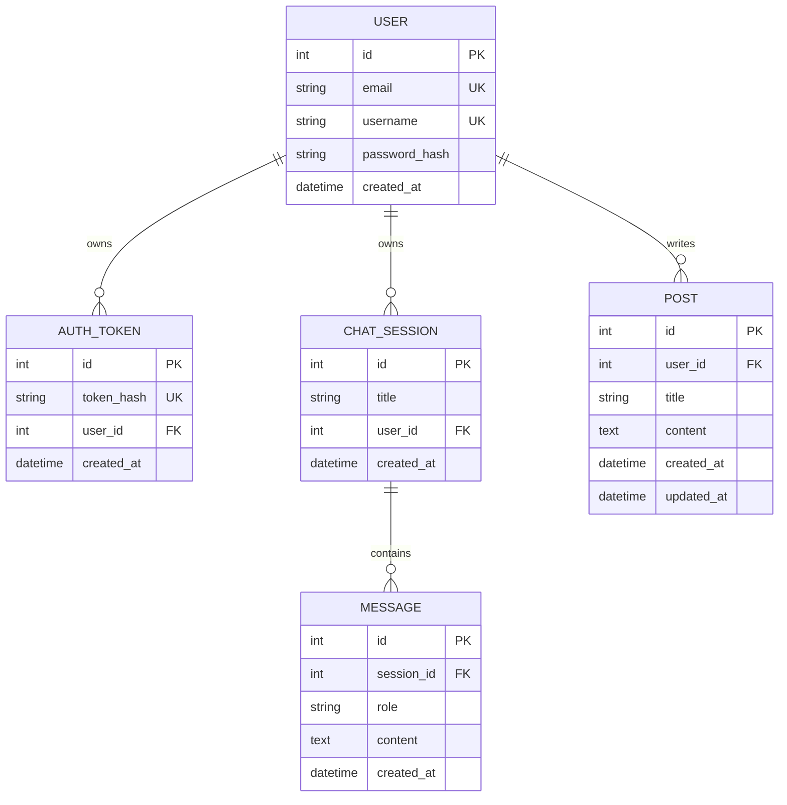

# B7-2 ERD

## 관계 정당성

- User 1:N ChatSession: 사용자별 대화 소유권을 DB FK로 고정합니다.
- ChatSession 1:N Message: 한 대화 세션에 메시지 순서를 누적합니다.
- User 1:N Post: 작성자 소유권으로 수정/삭제 권한을 판단합니다.
- User 1:N AuthToken: 로그인 토큰을 사용자와 연결하며 로그아웃 시 해당 토큰을 폐기합니다.

다른 사용자의 ChatSession은 `user_id` 조건으로 조회 자체를 제한합니다. Post 수정/삭제는 `post.user_id == current_user.id`를 확인합니다.
